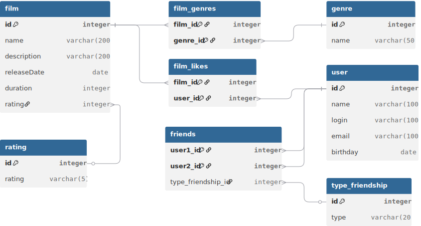

# java-filmorate
Template repository for Filmorate project.

## Database schema

## Примеры запросов:
### Получение пользователя по id:

SELECT *  
FROM users 
WHERE id = 1;

### Получение популярных фильмов:

SELECT f.*, COUNT(l.user_id) AS likes_count 
FROM films f 
LEFT JOIN likes l ON f.id = l.film_id 
GROUP BY f.id 
ORDER BY likes_count DESC 
LIMIT 10;

### Получение друзей пользователя:

SELECT u.* 
FROM users u 
JOIN friendship f ON u.id = f.friend_id 
WHERE f.user_id = 1 
AND f.status = 'CONFIRMED';

### Получение общих друзей:

SELECT u.* 
FROM users u 
JOIN friendship f1 ON u.id = f1.friend_id 
JOIN friendship f2 ON u.id = f2.friend_id 
WHERE f1.user_id = 1 
AND f2.user_id = 2 
AND f1.status = 'CONFIRMED' 
AND f2.status = 'CONFIRMED';